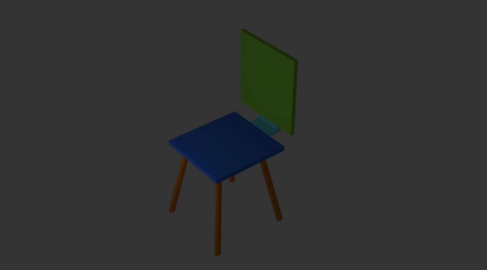
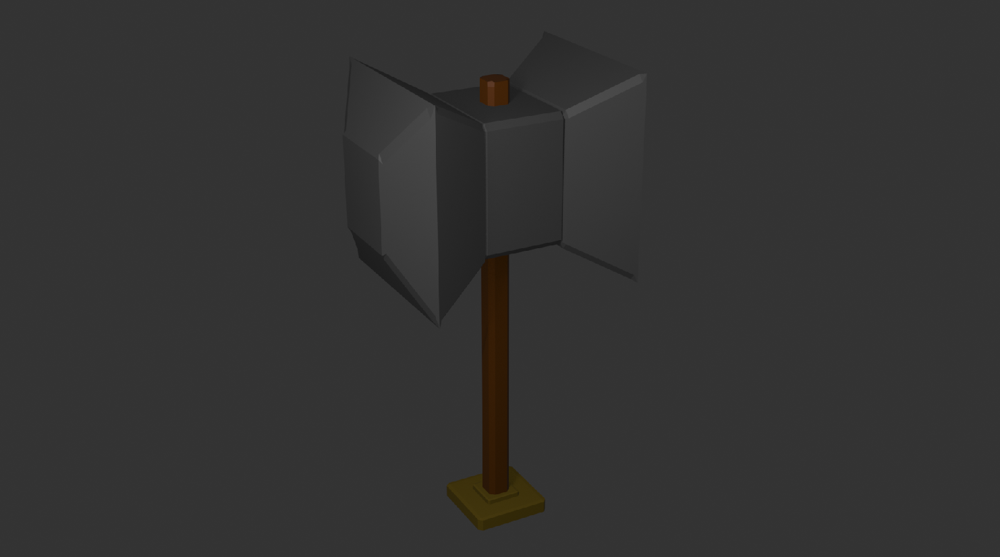
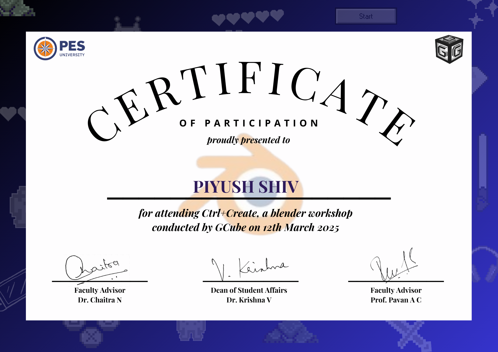
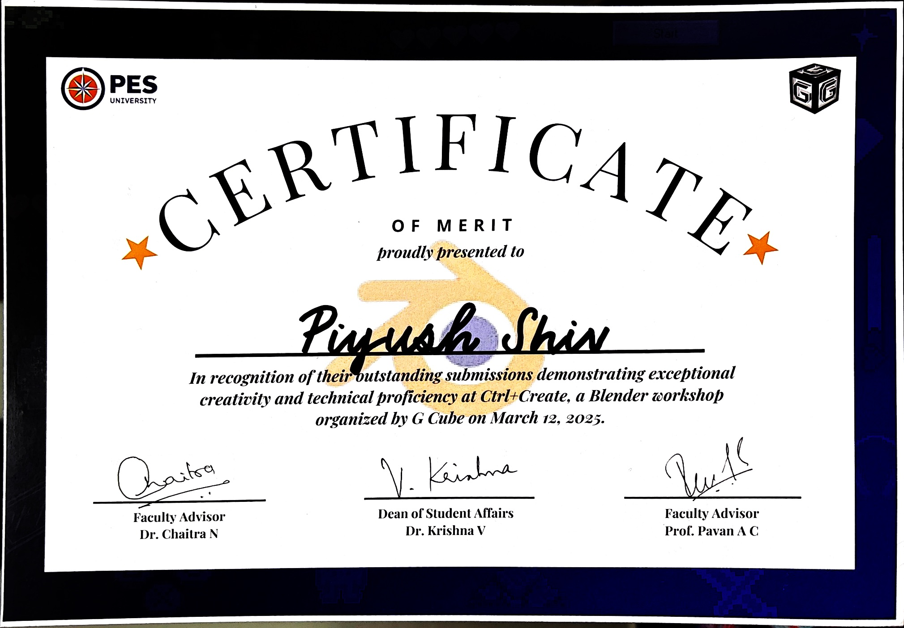

# Ctrl+Create Blender Workshop Assets

This repository contains Blender models, renders, and participation certificates created during the **Ctrl+Create Blender Workshop**. The workshop focused on learning 3D modeling techniques, navigation, and rendering in Blender.

---

## 📁 Files

```

├── Chair.blend             → 3D model of a simple chair
├── Chair.png               → Render of the chair model
├── Hammer.blend            → 3D model of a stylized hammer
├── Hammer.png              → Render of the hammer model
├── Notes.md                → Quick reference notes from the workshop
├── Piyush_cert1.png        → Participation Certificate
├── Piyush_cert2.jpg        → Achievement Certificate (if applicable)
└── readme.md               → This file

```

---

## 🪑 Chair Model

- **File**: `Chair.blend`  
- **Render**:  
  

- **Techniques Used**:
  - Base mesh modeling
  - Bevel and subdivision modifiers
  - Simple materials and viewport lighting

- ⚙️ _Note_: A metal material could have been added to make the chair more realistic.
---

## 🔨 Hammer Model

- **File**: `Hammer.blend`  
- **Render**:  
  

- **Techniques Used**:
  - Boolean modifier for precision cutting
  - Mirroring for symmetry
  - Material slot assignment and basic shading

- ⚙️ _Note_: Adding a metal shader could enhance the hammer's realism and give it a more polished finish.
---

## 🗒️ Workshop Notes

Refer to [`Notes.md`](./Notes.md) for quick Blender shortcuts, modifier usage, and material basics covered during the sessions.

---

## 📜 Certificates

### **Participation Certificate:**  


### **Achievement Certificate:**  


---

## 📌 Notes
- These models were created as part of personal practice and portfolio development.
- Free to use for learning and non-commercial purposes with credit.

---

## 🙏 Acknowledgements

A huge thanks to **G Cube PESU** for organizing the Ctrl+Create_ Blender Workshop and providing such an engaging hands-on experience in 3D design.

---

Created by **Piyush Shiv**

